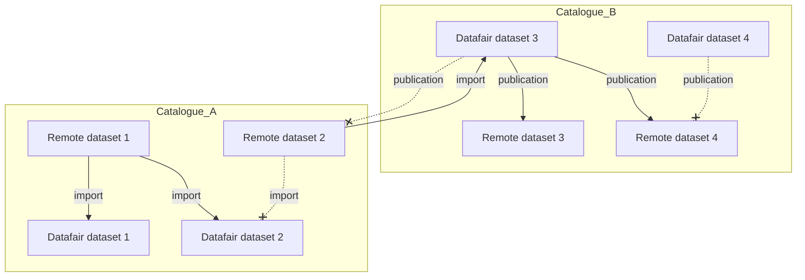

# Contribution guidelines

## Prerequisites

- A Javascript/Typescript IDE with [Vue.js](https://vuejs.org/) and [ESLint](https://marketplace.visualstudio.com/items?itemName=dbaeumer.vscode-eslint) support.
- A recent [Docker](https://docs.docker.com/engine/install/) installation.
- [Node.js v24+](https://nodejs.org/)

## Install dependencies

1. Install npm dependencies for all workspaces :

```sh
npm i
```

2. Build / Update the types based on schemas :

```sh
npm run build-types
```

3. Create a local `.env` file with random ports for this checkout :

```sh
./dev/init-env.sh
```

4. Install the Playwright browser used by the end-to-end tests :

```sh
npx playwright install chromium
```

## Start the development environment

```sh
npm run dev-zellij
```

*Note : This command will start a Zellij session with several panes, each one running a part of the project. The dev server URL (with the random ports from `.env`) is printed in the bottom banner. You can also run the environment manually by running the commands below in different terminals.*

<details>
<summary>Services</summary>

- **Dev dependencies** : `npm run dev-deps`
- **Api** : `npm run dev-api`
- **UI** : `npm run dev-ui`
- **Worker** : `npm run dev-worker`

</details>

## Stop the development environment

```sh
npm run stop-dev-deps
```

## Building the Docker images

```sh
docker build --progress=plain --target=main -t data-fair/catalogs:dev .
docker build --progress=plain --target=worker -t data-fair/catalogs/worker:dev .
```

## Working on several branches at once

Each checkout has its own `.env` with random ports, so you can run multiple worktrees side
by side without port collisions :

```sh
./dev/worktree.sh feat-xyz        # create ../catalogs_feat-xyz, install and build it
./dev/delete-worktree.sh feat-xyz # stop its docker compose services and remove it
```

You can check the health of the current environment at any time :

```sh
bash dev/status.sh
```

## Running the tests

The test suite uses [Playwright](https://playwright.dev/) and runs against the **running
dev environment** — the dev environment is the test environment. Start it first
(`npm run dev-zellij`), then :

```sh
npm test            # all tests (unit + api + e2e)
npm run test-unit   # unit tests only (no running services needed)
npm run test-api    # API tests only
npm run test-e2e    # browser e2e tests only
```

To run a specific file :

```sh
npx playwright test tests/features/plugins/registry.api.spec.ts
```

Tests live under `tests/features/<topic>/<name>.{unit,api,e2e}.spec.ts`. They reset state
through the `test_*`-prefixed accounts (see `dev/resources/users.json` and
`dev/resources/organizations.json`); interactive data under other accounts is left
untouched.

## Zellij installation

<details>
<summary>Guide</summary>

1) Install Rust's Cargo

```sh
curl https://sh.rustup.rs -sSf | sh
# choose 1 when prompted
```

2) Install Zellij

```sh
cargo install --locked zellij
```

3) Install NVM

```sh
curl -o- https://raw.githubusercontent.com/nvm-sh/nvm/master/install.sh | bash
nvm install
```

*Tips :*

- Use <kbd>Ctrl</kbd> + <kbd>Q</kbd> to quit Zellij.
- Click on a panel, then use <kbd>Ctrl</kbd> + <kbd>C</kbd> then <kbd>Esc</kbd> to stop a terminal and regain access of the panel.

</details>

## Setup the development environment

> To work on the dataset publication feature, you first need to add a publication site and setup an API Key on Data Fair.

*Note : the snippets below use `http://localhost:5600` as the Data Fair URL. Replace it with your actual dev server URL — the host and ports are randomized per checkout and printed in the zellij banner (see `.env`).*

A. Congifure the publication site

You can configure the publication site for each organization on which you want to run your tests.

Here is the command to type in the browser console, while being connected as a super administrator:

```js
fetch('http://localhost:5600/data-fair/api/v1/settings/user/superadmin/publication-sites', {
  method: 'POST',
  headers: { 'Content-Type': 'application/json' },
  body: JSON.stringify({
      "type": "back-office",
      "id": "data-fair",
      "title": "Back Office",
      "url": "http://koumoul.com/data-fair",
      "datasetUrlTemplate": "http://koumoul.com/data-fair"
    })
})
```

*You can replace in the URL the type (user/organization) and the account ID to configure (here superadmin)*

B. Configure the API Key

In the browser console, while being connected as a super administrator, you can create an API key used by the worker to import datasets and read metadata of datasets from the Data Fair API.

```js
fetch('http://localhost:5600/data-fair/api/v1/settings/user/superadmin', {
  method: 'PUT',
  headers: { 'Content-Type': 'application/json' },
  body: JSON.stringify({
    "apiKeys": [{
      "title": "Catalogs",
      "scopes": ["datasets"],
      "adminMode": true,
      "asAccount": true
    }]
  })
})
.then(response => response.json())
.then(data => console.log(data.apiKeys[0].clearKey))
.catch(error => console.error('Erreur:', error));
```

Then copy the `clearKey` value returned by the API and paste it in a new file `worker/config/local-development.cjs` file :

```js
export default {
  dataFairAPIKey: 'your api key here',
}
```

## Random information

<details>
<summary>Expand...</summary>

### package.json scripts description

- `"prepare": "husky || true"` : Initializes Husky hooks before the first `npm install`. The `|| true` ensures the command doesn't fail if Husky is not installed or encounters an error.

</details>

## Permissions rules

- Only admin and superadmins can create, read, update and delete catalogs.
- Only admin and superadmins can import or publish datasets.

- In the UI, if we have the right to see a catalog, but the active account is not the same as the owner, an alert is shown to the user to inform him to change the active account.
- Plugins are available for all admins users !

### Permissions Matrix to create/edit/delete catalogs

*How to read : A user in (organization/department) (can/cannot) create/edit a catalog in (organization/department) level*

| User Level | Permission | Catalog Level |
|------------|--------------|------------|
| Organization | ✅ Can | Organization |
| Organization | ✅ Can | Department |
| Department | ❌ Cannot | Organization |
| Department | ✅ Can | Department |

### Permissions to import datasets

- For the moment, the owner of the imported dataset must be the same as the owner of the catalog.
- An organization admin can import datasets from any catalog, including those owned by a department.
- A department admin can only import datasets from catalogs owned by the same department.

### Permissions Matrix to publishing datasets

| Dataset Level | Catalog Level | User Level | Permission | Comments |
|------------|------------|--------------|------------|-|
| Organization | Organization | Organization | ✅ Allowed | |
| Organization | Organization | Department | ❌ Forbidden | |
| Organization | Department | Organization | ❌ Forbidden | |
| Organization | Department | Department | ❌ Forbidden | |
| Department | Organization | Organization | ✅ Allowed | |
| Department | Organization | Department | ❓ Ask admin | TODO: For the moment, this is just forbidden |
| Department | Department | Organization | ✅ Allowed | |
| Department | Department | Department | ✅ Allowed | |

## Possible relations between Remote datasets and Datafair datasets


